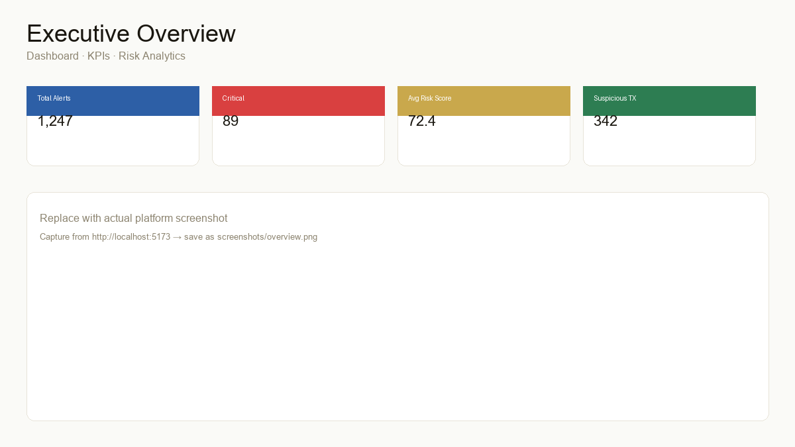
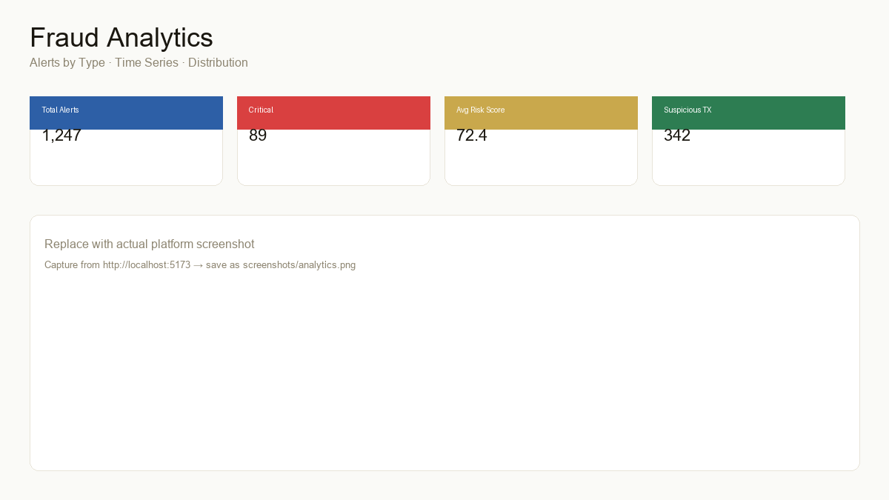
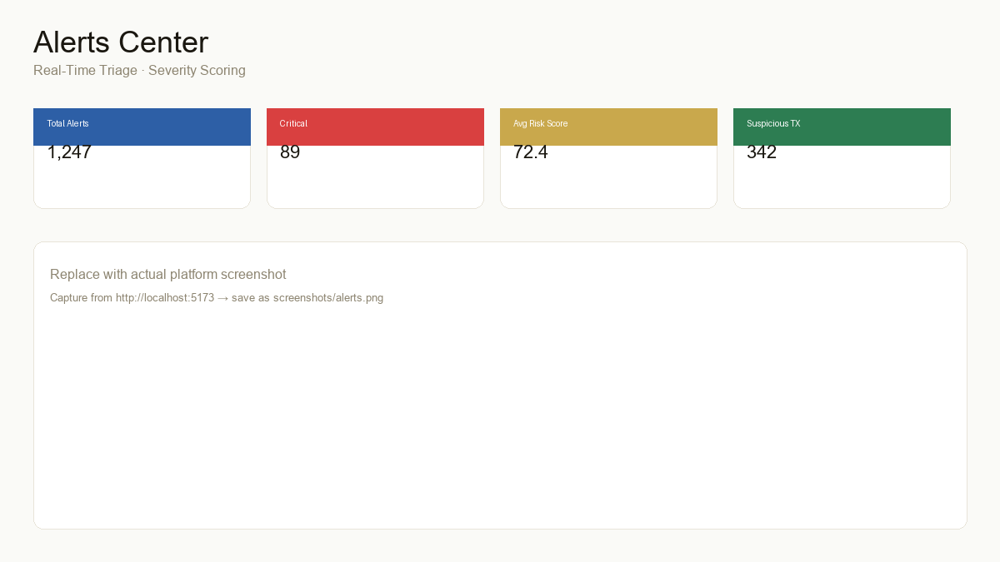

# Driven Fraud Detection Platform

Enterprise anti-fraud platform for real-time risk monitoring, investigative analytics, and financial crime operations.

[]()
[]()
[]()
[]()

---

## Overview

Full-stack platform combining transactional monitoring, behavioral risk analysis, investigative workflows, and an ML-ready scoring layer — built with production-oriented architecture for fraud prevention and risk analytics teams.

| Module | Description |
|---|---|
| Executive Dashboard | KPIs, risk scores, alert distribution, time-series analytics |
| Alert Center | Real-time triage with severity scoring and filters |
| Investigations | Case management with event timelines |
| Transactions | End-to-end transaction surveillance |
| Clients | Customer risk profiling and activity correlation |
| Rules Engine | Configurable anti-fraud rules with trigger analytics |
| AI Reports | Investigative summaries (LLM-ready architecture) |

---

## Platform Preview

> Screenshots are added manually from the running platform. Save captures to `./screenshots/` using the filenames below.

### Executive Overview



### Fraud Analytics



### Alerts Center



### ML Monitoring


### Transactions


---

## Architecture

```
┌─────────────────────────────────────────────────────────────┐
│  Frontend — React 18 · Vite · TailwindCSS · Recharts        │
│  Dashboard │ Alerts │ Investigations │ Transactions │ Rules │
└────────────────────────────┬────────────────────────────────┘
                             │ REST /api/v1
┌────────────────────────────▼────────────────────────────────┐
│  Backend — FastAPI · Pydantic · SQLAlchemy                  │
└────────────────────────────┬────────────────────────────────┘
         ┌───────────────────┼───────────────────┐
         ▼                   ▼                   ▼
   ML Pipeline          PostgreSQL          Observability
   scoring · inference  SQLite · seed       health · logs
```

Detailed documentation: **[ARCHITECTURE.md](./ARCHITECTURE.md)**

---

## Tech Stack

| Layer | Technology |
|---|---|
| Frontend | React 18, Vite 5, TailwindCSS, Recharts |
| Backend | Python 3.11, FastAPI, Uvicorn |
| Database | PostgreSQL / SQLite, SQLAlchemy 2 |
| Validation | Pydantic v2 |
| ML | Modular pipeline (`ml-pipeline/`) |
| DevOps | Docker Compose |

---

## API Reference

| Endpoint | Description |
|---|---|
| `GET /api/v1/dashboard/metrics` | Executive KPIs |
| `GET /api/v1/alerts/` | Fraud alerts |
| `GET /api/v1/alerts/{id}` | Alert detail |
| `POST /api/v1/alerts/{id}/generate-report` | AI investigative report |
| `GET /api/v1/investigations/` | Investigation cases |
| `GET /api/v1/transactions/` | Monitored transactions |
| `GET /api/v1/clients/` | Customer profiles |
| `GET /api/v1/rules/` | Anti-fraud rules |
| `GET /health` | Health check |
| `GET /docs` | Swagger UI |

---

## Project Structure

```
Driven-Fraud-Detection-Platform/
├── frontend/          # React SPA
├── backend/           # FastAPI REST API
├── ml-pipeline/       # Scoring, inference, monitoring
├── screenshots/       # Platform captures (manual)
├── architecture/      # Technical diagrams
├── docs/              # Product documentation
├── scripts/           # Development scripts
├── config/            # Environment templates
├── tests/             # Test suites
├── docker-compose.yml
└── ARCHITECTURE.md
```

---

## Quick Start

**Backend**

```bash
cd backend
python -m venv venv && venv\Scripts\activate    # Windows
pip install -r requirements.txt
cp ../config/.env.example .env
uvicorn app.main:app --reload --port 8000
```

**Frontend**

```bash
cd frontend
npm install
npm run dev
```

| Service | URL |
|---|---|
| Frontend | http://localhost:5173 |
| API | http://localhost:8000 |
| Swagger | http://localhost:8000/docs |

**Docker Compose:** `docker-compose up -d`

**Windows script:** `.\scripts\start-dev.ps1`

---

## Documentation

- [ARCHITECTURE.md](./ARCHITECTURE.md) — system design and data flow
- [docs/roadmap.md](./docs/roadmap.md) — product roadmap
- [ml-pipeline/README.md](./ml-pipeline/README.md) — ML layer structure
- [screenshots/README.md](./screenshots/README.md) — how to add platform captures

---

## License

MIT — see [LICENSE](./LICENSE).
