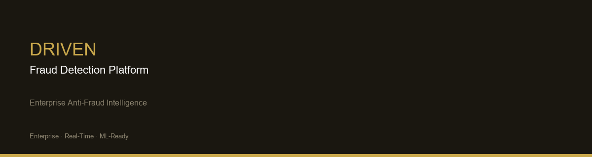

<p align="center">
  
</p>

<h1 align="center">Driven Fraud Detection Platform</h1>

<p align="center">
  <strong>Enterprise-grade fraud intelligence, real-time risk monitoring & investigative analytics</strong>
</p>

<p align="center">
  
  
  
  
  
  
</p>

<p align="center">
  <a href="#platform-preview">Preview</a> •
  <a href="#overview">Overview</a> •
  <a href="#architecture">Architecture</a> •
  <a href="#tech-stack">Stack</a> •
  <a href="#quick-start">Quick Start</a> •
  <a href="#api-reference">APIs</a> •
  <a href="#differentiators">Differentiators</a>
</p>

---

## Overview

**Driven Fraud Detection Platform** is a full-stack enterprise anti-fraud solution designed for financial institutions, fintechs, and risk operations teams. The platform combines **real-time transactional monitoring**, **behavioral risk analysis**, **investigative workflows**, and **ML-ready scoring pipelines** into a single, production-oriented architecture.

Built to demonstrate senior-level engineering for **fraud prevention**, **risk analytics**, and **financial crime investigation** roles.

### Core Capabilities

| Capability | Description |
|---|---|
| **Executive Dashboards** | KPIs, risk scores, alert distribution, and time-series analytics |
| **Fraud Alert Center** | Real-time alert triage with severity scoring and filtering |
| **Investigation Workspace** | Case management with event timelines and analyst workflows |
| **Transactional Monitoring** | End-to-end transaction surveillance with risk classification |
| **Client Risk Profiling** | Customer-level risk levels and activity correlation |
| **Anti-Fraud Rules Engine** | Configurable detection rules with trigger analytics |
| **AI Investigation Reports** | Automated investigative summaries (LLM-ready architecture) |
| **ML Pipeline** | Modular scoring, inference, and monitoring layer |

---

## Platform Preview

### Executive Overview


### Fraud Analytics


### Risk Monitoring


### Alerts Center


### ML Monitoring


### System Architecture


---

## Architecture

```
┌──────────────────────────────────────────────────────────────────────┐
│                         PRESENTATION LAYER                            │
│              React 18 · Vite · TailwindCSS · Recharts                 │
│     Dashboard │ Alerts │ Investigations │ Transactions │ Rules       │
└───────────────────────────────┬──────────────────────────────────────┘
                                │ REST / JSON  (/api/v1)
┌───────────────────────────────▼──────────────────────────────────────┐
│                         APPLICATION LAYER                             │
│                   FastAPI · Pydantic · SQLAlchemy                       │
│   Dashboard API │ Alerts API │ Investigations │ Clients │ Rules      │
└───────────────────────────────┬──────────────────────────────────────┘
                                │
        ┌───────────────────────┼───────────────────────┐
        │                       │                       │
┌───────▼────────┐   ┌──────────▼─────────┐   ┌────────▼────────┐
│  ML PIPELINE   │   │   DATA LAYER        │   │  OBSERVABILITY  │
│  Scoring       │   │  PostgreSQL/SQLite  │   │  Health · Logs  │
│  Inference     │   │  Seed · Reports     │   │  API Metrics    │
│  Monitoring    │   │                     │   │                 │
└────────────────┘   └─────────────────────┘   └─────────────────┘
```

> Full technical documentation: **[ARCHITECTURE.md](./ARCHITECTURE.md)**

---

## Tech Stack

| Layer | Technology | Purpose |
|---|---|---|
| **Frontend** | React 18, Vite 5, TailwindCSS | Executive UI, real-time dashboards |
| **Backend** | Python 3.11, FastAPI, Uvicorn | High-performance REST APIs |
| **Data** | PostgreSQL / SQLite, SQLAlchemy 2 | Transactional & investigative data |
| **Validation** | Pydantic v2 | Schema enforcement & type safety |
| **Charts** | Recharts | Risk analytics visualization |
| **ML Layer** | Modular pipeline (scikit-learn ready) | Fraud scoring & inference |
| **DevOps** | Docker Compose | Local & staging orchestration |

---

## Data Flow

```
Transaction Event
      │
      ▼
┌─────────────┐     ┌──────────────┐     ┌─────────────────┐
│  Ingestion  │────▶│ Rules Engine │────▶│  Risk Scoring   │
└─────────────┘     └──────────────┘     └────────┬────────┘
                                                     │
                     ┌───────────────────────────────┤
                     ▼                               ▼
              ┌─────────────┐                ┌─────────────┐
              │ Alert Queue │                │ Investigation│
              └──────┬──────┘                └──────┬──────┘
                     │                               │
                     └───────────┬───────────────────┘
                                 ▼
                        ┌─────────────────┐
                        │ Executive       │
                        │ Dashboard & KPIs│
                        └─────────────────┘
```

---

## ML Pipeline

The `ml-pipeline/` module provides a production-ready structure for fraud detection models:

- **Feature engineering** — transaction velocity, device fingerprint, geo-anomaly
- **Risk scoring** — probabilistic fraud scores (0–100)
- **Inference service** — real-time scoring API integration point
- **Model monitoring** — drift detection, performance KPIs, alert thresholds

> Current release uses rule-based scoring with a clear migration path to ML models. See [`ml-pipeline/README.md`](./ml-pipeline/README.md).

---

## API Reference

| Endpoint | Method | Description |
|---|---|---|
| `/api/v1/dashboard/metrics` | GET | Executive KPIs and analytics |
| `/api/v1/alerts/` | GET | Paginated fraud alerts with filters |
| `/api/v1/alerts/{id}` | GET | Alert detail with transactions |
| `/api/v1/alerts/{id}/generate-report` | POST | AI investigative report |
| `/api/v1/investigations/` | GET | Investigation cases |
| `/api/v1/investigations/{id}` | GET | Case detail with timeline |
| `/api/v1/transactions/` | GET | Monitored transactions |
| `/api/v1/clients/` | GET | Customer risk profiles |
| `/api/v1/rules/` | GET | Anti-fraud rules catalog |
| `/health` | GET | Service health check |
| `/docs` | GET | Interactive Swagger UI |

---

## Project Structure

```
Driven-Fraud-Detection-Platform/
│
├── frontend/              # React SPA — dashboards & investigative UI
├── backend/               # FastAPI — REST APIs & business logic
├── ml-pipeline/           # ML scoring, inference & monitoring
├── data/                  # Datasets, seeds & reference data
├── docs/                  # Product & technical documentation
├── screenshots/           # Platform visuals for README & LinkedIn
├── architecture/          # Architecture diagrams & ADRs
├── scripts/               # Dev, deploy & utility scripts
├── config/                # Environment templates & deployment config
├── reports/               # Generated investigation reports
├── tests/                 # Backend & frontend test suites
│
├── README.md
├── ARCHITECTURE.md
├── requirements.txt
├── docker-compose.yml
├── .gitignore
└── LICENSE
```

---

## Quick Start

### Prerequisites

- Python 3.11+
- Node.js 18+
- Docker (optional, for PostgreSQL)

### Option A — Docker Compose

```bash
docker-compose up -d
```

- Frontend: http://localhost:5173
- Backend API: http://localhost:8000
- Swagger Docs: http://localhost:8000/docs

### Option B — Local Development

**Backend**

```bash
cd backend
python -m venv venv
# Windows
venv\Scripts\activate
# macOS/Linux
source venv/bin/activate

pip install -r requirements.txt
cp ../config/.env.example .env
uvicorn app.main:app --reload --port 8000
```

**Frontend**

```bash
cd frontend
npm install
npm run dev
```

**Or use helper scripts:**

```powershell
# Windows
.\scripts\start-dev.ps1
```

```bash
# macOS/Linux
./scripts/start-dev.sh
```

---

## Technical Differentiators

- **Enterprise monorepo** — clear separation of concerns across layers
- **API-first design** — OpenAPI/Swagger auto-generated documentation
- **Risk-native data model** — alerts, transactions, investigations, rules
- **Investigation-grade UX** — timelines, scoring badges, executive KPIs
- **ML-ready architecture** — pipeline module decoupled from API layer
- **Observability hooks** — health endpoints, structured logging ready
- **Demo seed data** — realistic fraud scenarios for portfolio demos
- **Date-range analytics** — executive filtering across all modules
- **AI report generation** — extensible to LLM providers (Claude, GPT-4)

---

## Observability

| Signal | Implementation |
|---|---|
| Health checks | `GET /health` |
| API documentation | Swagger UI at `/docs` |
| Error handling | Centralized API interceptors (frontend) |
| ML monitoring | `ml-pipeline/monitoring/` KPI framework |
| Audit trail | Investigation timelines & alert history |

---

## Use Cases

- **Fraud Operations** — alert triage, case investigation, analyst workflows
- **Risk Management** — portfolio-level risk scoring and KPI tracking
- **Compliance** — audit-ready investigation reports and event timelines
- **Data Science** — ML pipeline integration for behavioral scoring
- **Engineering Leadership** — reference architecture for fintech anti-fraud

---

## Roadmap

See [`docs/roadmap.md`](./docs/roadmap.md) for the full product roadmap.

| Version | Highlights |
|---|---|
| **v1.0** | Dashboard, alerts, investigations, rules, clients |
| **v1.1** | JWT auth, WebSocket notifications, CSV/PDF export |
| **v2.0** | LLM integration, ML scoring, geo-analytics |

---

## Author

Built as a **senior-level portfolio project** for roles in:

- Fraud Prevention & Financial Crime
- Risk Analytics & Data Science
- Backend / Full-Stack Engineering (Fintech)
- Anti-Fraud Platform Engineering

---

<p align="center">
  <strong>Driven Fraud Detection Platform</strong><br/>
  Enterprise Anti-Fraud Intelligence · Real-Time Risk · Investigative Analytics
</p>

<p align="center">
  <sub>© 2024–2026 Driven Platform · MIT License</sub>
</p>
