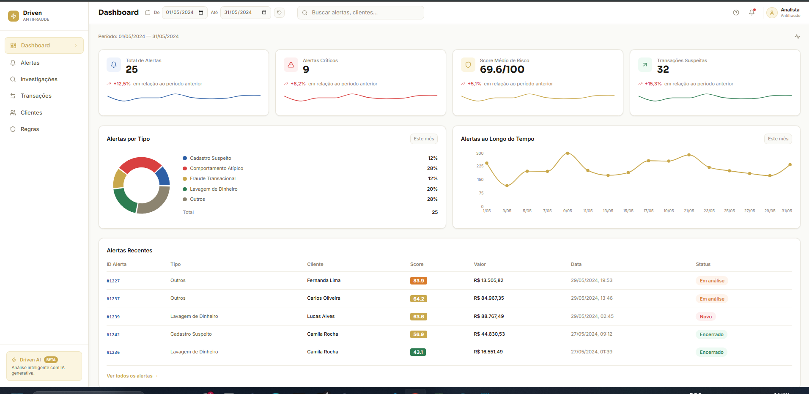
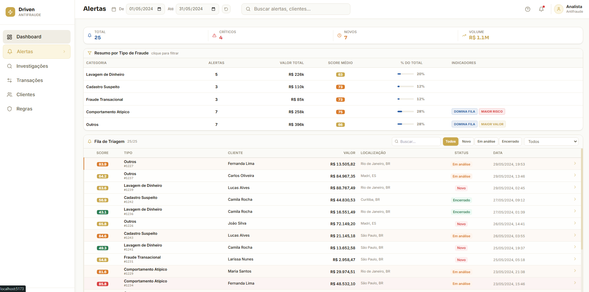
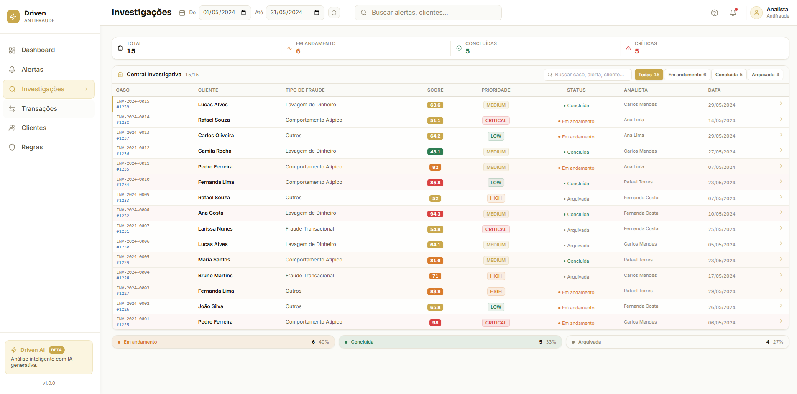
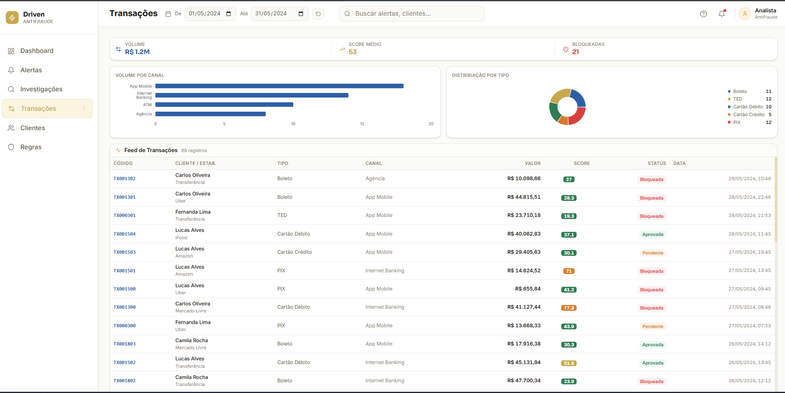
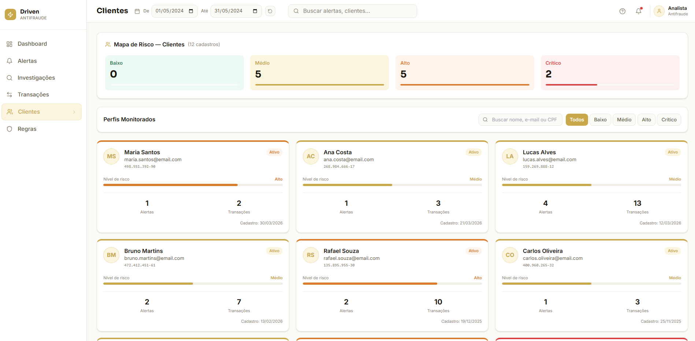
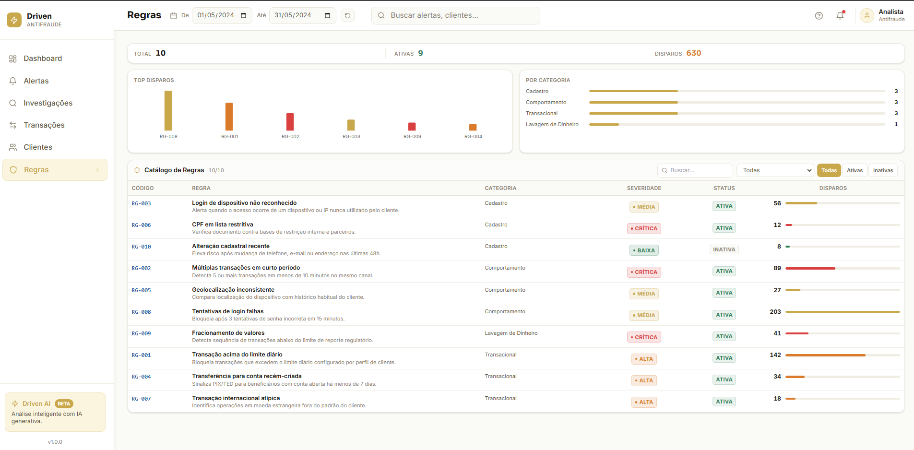

# Driven Fraud Detection Platform

Plataforma web de monitoramento e investigação antifraude com dashboard operacional, APIs REST, arquitetura analítica baseada em Data Medallion e conceito Lakehouse.

[]()
[]()
[]()
[]()
[]()
[]()
[]()
[]()

---

## Overview

Aplicação full-stack para visualização e triagem de alertas, investigações, transações, clientes e regras antifraude. O frontend consome APIs REST do backend FastAPI; os dados exibidos vêm do banco populado automaticamente por seed na inicialização.

| Módulo | O que faz na prática |
|---|---|
| Dashboard | KPIs, gráfico de alertas por tipo e tabela de alertas recentes |
| Alertas | Resumo por tipo de fraude e fila de triagem em tabela |
| Investigações | Listagem operacional de casos com status, prioridade e analista |
| Transações | KPIs, gráficos por canal/tipo e feed transacional em tabela |
| Clientes | Mapa de risco e perfis com nível de exposição |
| Regras | KPIs, gráficos de disparos e catálogo de regras |

---

## Sobre o Projeto

A **Driven Fraud Detection Platform** é um sistema de demonstração que simula o fluxo de uma central antifraude corporativa. Foi construído com **React 18** no frontend e **FastAPI** no backend, comunicando-se via APIs versionadas em `/api/v1`.

O ambiente local utiliza **SQLite** por padrão (`sqlite:///./fraud.db`), configurado em `config/.env.example`. O `docker-compose.yml` oferece opção com PostgreSQL, mas o fluxo principal documentado é desenvolvimento local com seed automático.

| Recurso | Implementação real |
|---|---|
| Dashboard operacional | KPIs via `GET /api/v1/dashboard/metrics` |
| Filtro de período | `DateRangeFilter` no navbar — aplicado ao dashboard |
| Central de alertas | Resumo analítico por tipo + tabela de triagem |
| Investigações | Tabela com status (Em andamento, Concluída, Arquivada) |
| Transações | Gráficos Recharts + tabela compacta |
| Clientes | Perfis com nível de risco e contagem de alertas/transações |
| Regras | Listagem com severidade, status e disparos |
| Score visual | Badge colorido por faixa de risco (componente `ScoreBadge`) |
| Parecer automatizado | Endpoint `POST /alerts/{id}/generate-report` com texto baseado em regras |
| Dados de demo | Seed em `seed_service.py` — período base maio/2024 |

A pasta `ml-pipeline/` contém apenas documentação e estrutura preparada para evoluções futuras de scoring analítico. **Não há modelo treinado nem inferência em execução.**

---

## O Problema

Equipes de prevenção à fraude precisam consolidar alertas, transações e investigações em um único painel, com visibilidade de risco e priorização de casos. Planilhas e ferramentas desconectadas dificultam a triagem e aumentam o tempo de resposta.

Esta plataforma demonstra como organizar esse fluxo em uma interface única:

| Necessidade | Como o projeto responde hoje |
|---|---|
| Ver volume de alertas e casos críticos | Dashboard com KPIs e alertas recentes |
| Entender concentração por tipo de fraude | Resumo analítico na tela de Alertas |
| Acompanhar investigações | Listagem com status, prioridade e analista |
| Monitorar transações | Feed com score, canal, tipo e status |
| Avaliar exposição por cliente | Perfis com nível de risco e histórico |
| Consultar regras e disparos | Catálogo com severidade e contagem |

---

## Dashboard Online

Acesse a versão publicada da plataforma:

**https://driven-fraud-detection-platform.vercel.app**

---

## Funcionalidades Implementadas

Rotas definidas em `frontend/src/App.jsx`:

| Tela | Rota | Funcionalidade |
|---|---|---|
| Dashboard | `/` | 4 KPIs, pizza por tipo de fraude (API), gráfico de linha (dados fixos no frontend), 5 alertas recentes |
| Alertas | `/alertas` | KPIs, resumo por categoria (clicável), tabela com filtros e busca |
| Detalhe do alerta | `/alertas/:id` | Dados do cliente, dispositivo, transações vinculadas, botão de parecer |
| Investigações | `/investigacoes` | KPIs por status, tabela operacional, busca |
| Detalhe da investigação | `/investigacoes/:id` | Timeline (JSON do seed), achados, alerta vinculado |
| Transações | `/transacoes` | KPIs de volume, gráficos, tabela de transações |
| Clientes | `/clientes` | Mapa de risco, filtros, cards de perfil |
| Regras | `/regras` | KPIs, gráfico de disparos, tabela de regras |

**Comportamentos reais:**

- Filtro de status e tipo de fraude na listagem de alertas (API)
- Filtro de período no dashboard (parâmetros `date_from` / `date_to`)
- Busca textual client-side em Alertas, Investigações, Clientes e Regras
- Score de risco exibido em alertas, transações e investigações
- Paginação básica via `skip` / `limit` nas APIs (frontend usa `limit` fixo)

**Limitações atuais (v1.0):**

- Gráfico de linha do dashboard usa série estática no frontend, não vem da API
- Sparklines nos cards de KPI também são ilustrativos
- Filtro de período não se aplica às telas de listagem
- Parecer do endpoint `generate-report` é gerado por regras/templates, sem LLM
- Sem autenticação ou controle de acesso
- Regras são somente leitura (sem CRUD)
- `ml-pipeline/` é estrutura documental, sem código de modelo

---

## Dados de Demonstração

Populados automaticamente por `backend/app/services/seed_service.py`:

| Entidade | Quantidade |
|---|---|
| Alertas | 25 |
| Transações | ~88 |
| Investigações | 15 |
| Clientes | 12 |
| Regras antifraude | 10 |

Período padrão do filtro: **01/05/2024 — 31/05/2024** (`frontend/src/config/demoPeriod.js`).

Tipos de fraude no seed: Fraude Transacional, Lavagem de Dinheiro, Cadastro Suspeito, Comportamento Atípico, Outros.

---

## Tech Stack

| Camada | Tecnologia |
|---|---|
| **Data Pipeline** | Python ETL (`seed_service.py`), SQLAlchemy ORM, serialização JSON (`json` stdlib) |
| **Analytics Layer** | Medallion Architecture (camadas lógicas), Gold JSON via respostas REST |
| **Operational Store** | SQLite (`fraud.db`) · PostgreSQL 16 opcional · conceito Lakehouse/ODS |
| **API Layer** | FastAPI 0.110, Uvicorn, Pydantic v2, OpenAPI/Swagger (`/docs`) |
| **Frontend** | React 18, Vite 5, TailwindCSS, Recharts, Axios, React Router 6 |
| **Demo Deploy** | Vercel (SPA estática) + mock fallback local (`frontend/src/mocks/`) |
| **Future Analytics** | `ml-pipeline/` — estrutura documental, sem modelo ativo |

---

## API Reference

Base: `/api/v1`

| Método | Endpoint | Descrição |
|---|---|---|
| `GET` | `/dashboard/metrics` | KPIs do dashboard (`date_from`, `date_to` opcionais) |
| `GET` | `/alerts/` | Lista alertas (`status`, `fraud_type`, `skip`, `limit`) |
| `GET` | `/alerts/{id}` | Detalhe do alerta com transações |
| `POST` | `/alerts/{id}/generate-report` | Parecer investigativo baseado em regras |
| `GET` | `/investigations/` | Lista investigações |
| `GET` | `/investigations/{id}` | Detalhe com timeline |
| `GET` | `/transactions/` | Lista transações |
| `GET` | `/clients/` | Lista clientes com contadores |
| `GET` | `/rules/` | Lista regras antifraude |
| `GET` | `/health` | Health check simples |
| `GET` | `/docs` | Swagger UI |

---

## Estrutura do Projeto

```
Driven-Fraud-Detection-Platform/
├── frontend/           # React SPA (páginas, componentes, layouts)
├── backend/            # FastAPI (api, models, services, seed)
├── ml-pipeline/        # Estrutura documental (sem implementação ativa)
├── screenshots/        # Capturas reais das telas
├── architecture/       # Diagramas técnicos
├── docs/               # Roadmap e índice
├── scripts/            # start-dev.ps1
├── config/             # .env.example, Dockerfiles
└── docker-compose.yml  # Stack opcional com PostgreSQL
```

---

## Quick Start

**1. Backend**

```bash
cd backend
python -m venv venv && venv\Scripts\activate    # Windows
pip install -r requirements.txt
cp ../config/.env.example .env
uvicorn app.main:app --reload --port 8000
```

**2. Frontend**

```bash
cd frontend
npm install
npm run dev
```

| Serviço | URL |
|---|---|
| Frontend | http://localhost:5173 |
| API | http://localhost:8000 |
| Swagger | http://localhost:8000/docs |

**Windows:** `.\scripts\start-dev.ps1`

> O backend precisa estar rodando para os dados aparecerem no frontend.

---

## Capturas da Plataforma

Screenshots reais em `./screenshots/`:

### Dashboard



### Alertas



### Investigações



### Transações



### Clientes



### Regras



---

## Competências Demonstradas

| Área | Evidência no projeto |
|---|---|
| React | SPA com 8 rotas e componentes reutilizáveis |
| JavaScript | Frontend com Vite, Axios e Recharts |
| Python | Backend FastAPI com serviços e seed |
| FastAPI | 6 módulos de API REST documentados no Swagger |
| SQLAlchemy | Modelos, queries e agregações no dashboard |
| APIs REST | Contratos JSON com filtros e paginação |
| Dashboard Design | KPIs, gráficos e tabelas executivas |
| Data Visualization | Gráficos de pizza, barras e indicadores |
| Fraud Analytics | Resumo por tipo de fraude e score de risco |
| Risk Monitoring | Classificação visual e alertas críticos |
| Operational Analytics | Tabelas compactas de triagem e investigação |
| Git & GitHub | Versionamento e documentação do repositório |

---

## Documentação Complementar

| Documento | Conteúdo |
|---|---|
| [docs/README.md](./docs/README.md) | Índice da documentação |
| [docs/roadmap.md](./docs/roadmap.md) | Roadmap e limitações conhecidas |
| [ARCHITECTURE.md](./ARCHITECTURE.md) | Detalhes técnicos da arquitetura |

---

## License

Portfolio project — developed for technical demonstration of fraud analytics workflows, operational monitoring and investigation triage in an enterprise-style analytics environment.

**Driven Fraud Detection Platform** · Fraud Analytics · Risk Monitoring · Operational Dashboards · Transaction Monitoring · Investigative Workflow · Medallion-inspired Analytics Architecture · Python ETL · REST APIs · React SPA

This repository is a professional showcase of full-stack analytics engineering applied to fraud prevention use cases: structured data layers, operational data store, dashboard KPIs, alert triage and case management — built as a realistic demonstration platform, not a production financial system.

| | |
|---|---|
| **License** | [MIT License](./LICENSE) |
| **Usage** | Free to use, modify and distribute with attribution |
| **Scope** | Demo data and educational portfolio purposes |

Copyright (c) 2024–2026 Driven Fraud Detection Platform. See [LICENSE](./LICENSE) for full terms.

---

If this project aligns with the type of analytics and operational engineering you value, consider starring the repository.

---

## Author

### Bruna Amaral

Fraud Analytics · Data Analytics · Prevenção à Fraude · Monitoramento de Risco · Python · SQL · Power BI

Profissional com experiência em prevenção à fraude, análise operacional, monitoramento transacional e automação de processos.

| Resource | Link |
|---|---|
| GitHub | https://github.com/BrunaAmaral2706 |
| Dashboard Online | https://driven-fraud-detection-platform.vercel.app |
